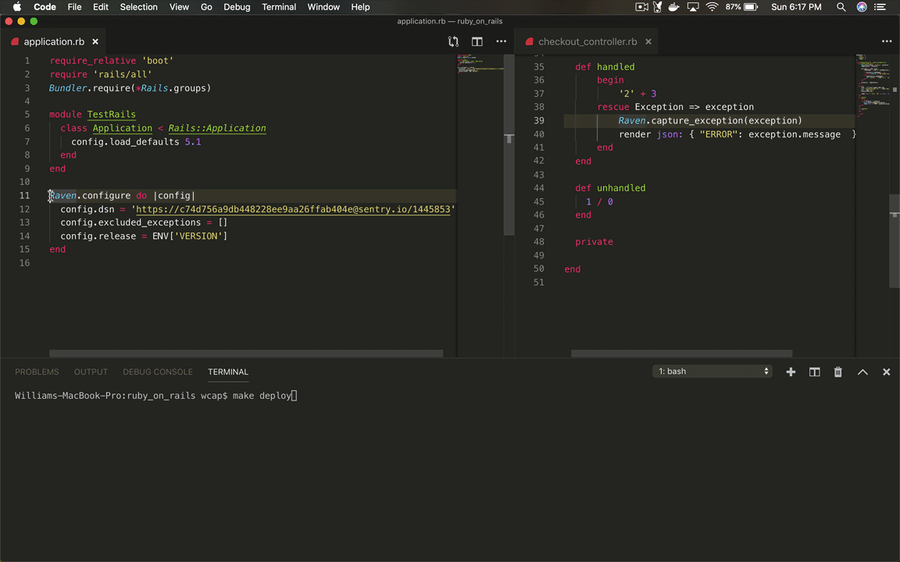

# sentry-demos/ruby_on_rails

## Versions Summary:

| dependency      | version           
| ------------- |:-------------:| 
| sentry-ruby      | 0.1.3  |
| ruby      | 2.6.3p62  |
| sentry-cli   | 1.59.0    |

This app demonstrates how to include and configure Sentry-Ruby into a Ruby on Rails application.

The Sentry-Ruby sdk replaces the sentry-raven sdk and will include new Sentry features going forward.

## Summary
To show how Sentry works in an example web app that uses Rails
- integrate the Sentry SDK into Rails https://docs.sentry.io/clients/ruby/
- trigger error that gets sent as event to sentry.io
- `checkout_controller.rb` has multiple endpoints for showing different ways that errors are handled
- Sentry Release cycle covered in `Makefile`

## Initial Setup & Run
1. Install Ruby version 2.3.3p222 and Rails version 5.1.7

2. install gems

```
bundle install
```

3. Set the DSN in application.rb

``` ruby
Sentry.init do |config|
  config.dsn = 'https://*******@sentry.io/22323232343'
end
```

4. Configure sentry-cli (is for creating Sentry releases) with your `SENTRY_AUTH_TOKEN` in Makefile or run `export SENTRY_AUTH_TOKEN=<your_auth_token>`. Do the same for `SENTRY_ORG` and `SENTRY_PROJECT`
5. Check your Github repo is integrated into your Sentry organization.
6. run `make`, which (Makefile) creates a Sentry release and runs Rails
7. `make deploy` and go to `localhost:3001/handled`
## GIF



## Notes on routing errors
By default `sentry-ruby` ignores `ActionController::RoutingError`. For the purpose of demonstrating the `Undefined Route Error`, ```config.excluded_exceptions = []``` was added to the Raven config in `application.rb`. This configuration changes the default behavior to allow routing errors to appear in Sentry.

** Not yet updated for latest SDK **
More installation details here: https://docs.sentry.io/clients/ruby/
Reference documentation here: https://github.com/getsentry/sentry-ruby/tree/master/sentry-ruby
Information on migrating from sentry-raven here: https://github.com/getsentry/sentry-ruby/blob/master/MIGRATION.md